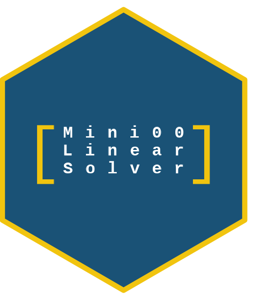

# MiniLinearSolver 

 <!-- badges: start -->
  [](https://github.com/KNieciecka/MiniLinearSolver/actions/workflows/R-CMD-check.yaml)
  <!-- badges: end -->

**MiniLinearSolver** is a R package made for solving systems of linear equations. It uses optimized C code with OpenMP API to provide fast and reliable numerical solutions.

## Features

- **LU Decomposition**: Efficient matrix factorization with partial pivoting.
- **Determinant Calculation**: Fast computation based on LU decomposition.
- **LU System Solver**: Solve $Ax = b$ systems using LU decomosition.
- **SOR Method**: Successive Over-Relaxation iterative solver for diagonally dominant matrices.
- **Multi-threading support**: Multi-threaded execution via OpenMP for large-scale matrices.

---

**Package Maintainer and Author:** Karolina Nieciecka

**Homepage:** [https://KNieciecka.github.io/MiniLinearSolver/](https://KNieciecka.github.io/MiniLinearSolver/)

**GitHub Repository:** [https://github.com/KNieciecka/MiniLinearSolver](https://github.com/KNieciecka/MiniLinearSolver)

**System Requirements:** `R >= 4.0`, C compiler with `OpenMP` support.

## Installation

You can install the development version of MiniLinearSolver from GitHub:

```R
# install.packages("devtools")
devtools::install_github("KNieciecka/MiniLinearSolver")

**License:** `MiniLinearSolver` source code is distributed under the open-source GPL-3 license. For more details, see [LICENSE](LICENSE.md).

**Changes:** See the [NEWS](NEWS.md) file.
